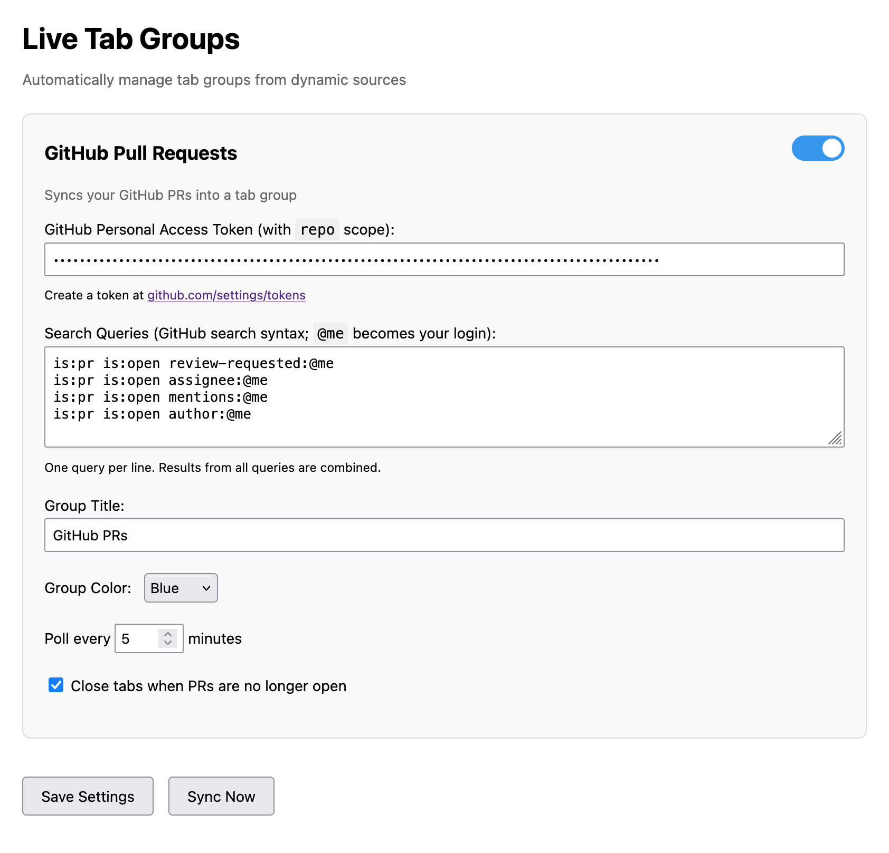

# Live Tab Groups

A Firefox extension that automatically creates and maintains tab groups from
dynamic sources.

## Features

* Automatically sync **GitHub pull requests** based on your search queries like
PRs you're reviewing, assigned to you, where you're mentioned or you created.
* Sort PR tabs by creation date (oldest first by default, or newest first) or
alphabetically by PR title (A–Z, ignoring case).

Choose **Sort PRs** in the extension settings. The order applies to results
combined across all queries, including tabs that are already open. Use **Sync
Now** to apply it immediately, or wait for the next scheduled sync. Tabs kept
outside the current results appear at the end of the group. Sorting keeps the
active tab selected and preserves PR sub-pages such as `/files`.

Each query currently fetches up to 100 results. Sorting applies to those fetched
results.

## Screenshots

## Development

Run the sorting tests with `node --test tests/*.test.cjs` (Node.js 18.0 or newer).
Lint the extension with `web-ext lint --ignore-files 'tests/**'`.
