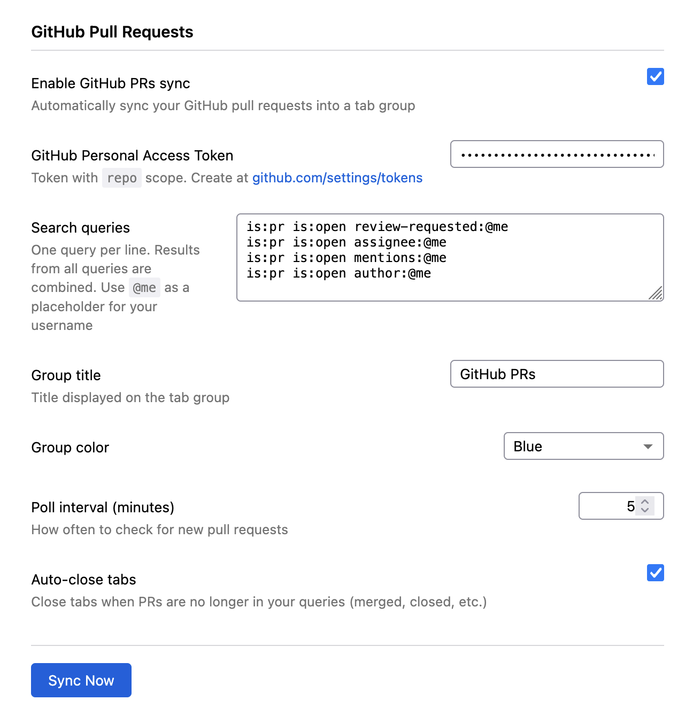

# Live Tab Groups

A Firefox extension that automatically creates and maintains tab groups from
dynamic sources.

## Features

* Automatically sync **GitHub pull requests** based on your search queries like
PRs you're reviewing, assigned to you, where you're mentioned or you created.

## Screenshots

